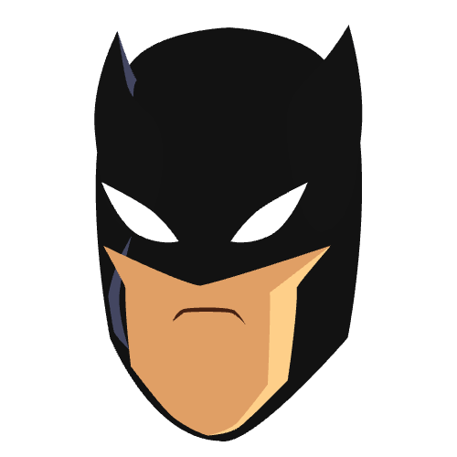

# 🦇🦇 BatTheme

  

A repo showcasing how to work with theme extensions in flutter. This repo serves as a code guide to the writeup <a href="https://github.com/mastersam07">Dressing your flutter widget with theme extension</a> and also the talk <a href="https://github.com/mastersam07">Dressing your flutter widget with theme extension</a>

[Link to Mockup](https://www.ls.graphics/free/simple-iphone-x-mockups)

Star⭐ the repo if you like what you see😉.

## Quick Start 🚀

## Feature Set ✨

* [ ] TODO
## RoadMap ✨
* [ ] TODO

### PDF TOOLS
* [ ] TODO

## 📸 ScreenShots

| Image| Image|
|------|-------|

## 🤓 Author(s)
**Samuel Abada** 